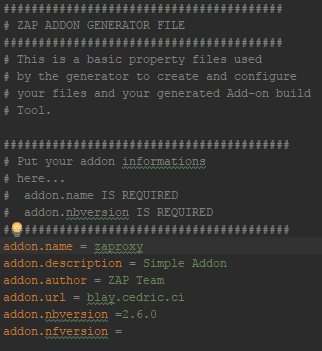
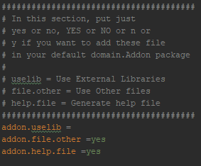
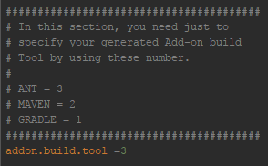

# OWASP ZAP Add-on Generator - Gen

Tha ZAP Add-on Generator is a project which created to allow to people
who wants to create a ZAP Add-on. This project generates the basic Add-on skeleton 
with/without build tool files (Maven, Ant, Gradle).

## Getting Started

First, you need to pull the Zap Gen repo.
Now you can see the Zap Gen project structure:

1 - is the folder "output/"
2 - is the file generator.properties

### Requirements - Generate Addon 

After, pulling the Zap Gen repo, you need to complete these steps before starting your zap Addon coding:

* Pull gen repo
* Pull **zaproxy** repo into the folder "output"
* Open **generator.properties** and fill it
* Compile and Run gen to obtain your Starting Zap Addon and his build file and others files (Your Addon will be create on the folder "output")

### Requirements - Compile, Run and deploy Addon

This Step are important to compile, run and deploy your addon: 

* Now your can open your zap Addon project and starting your code
* Just execute the build file locate in the folder "output" to compile, execute(Run zaproxy and your zap addon inside) and deploy your Zap Addon(generate the .zap archive)

### Description - generator.properties

This file is important to generate your Addon, so pay attention to the description :) : 

#### Description - Addon informations Section

* addon.name: your addon name
* addon.description: your addon description
* addon.author: your addon author name
* addon.url: your addon url
* addon.nbversion: your addon not before version
* addon.nfversion: your addon not for version

#### Description - Other files and Lib Section

* addon.uselib: Use libraries
* addon.file.other: Use other files
* addon.help.file: Use help files

#### Description - Build Tool Section

* addon.build.tool: Choose your build tool

## Libraries Used

These libraries are used to work on Zap Gen project:

* [Velocity](http://velocity.apache.org/) - Library used for Templates
* [Log4J](https://logging.apache.org/log4j/) - Library used for logging
